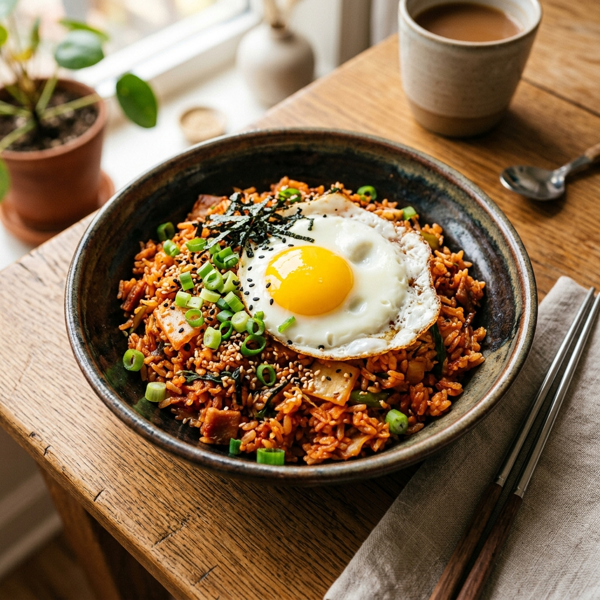

# 🍳 오늘의 주방 (Today's Kitchen)

> **"혼자 하는 요리를 함께하는 즐거움으로"**  
> Next.js와 Supabase Realtime을 결합한 1인 가구용 실시간 소셜 요리 플랫폼입니다.

---

### 🌐 [실제 서비스 구경하러 가기 (Live Demo)](https://todays-kitchen.vercel.app)



## 📋 프로젝트 개요

### 1. 기획 배경: "요리는 귀찮지만, 배달은 물린 당신을 위해"
- **결정 장애 해결**: 무엇을 먹을지 고민하는 에너지를 줄이기 위해 봇이 메뉴를 추천하고, 유저는 요리 그 자체에 집중할 수 있게 합니다.
- **사회적 고립감 해소**: 1인 가구의 '혼밥'이 일상이 된 시대, 실시간 상태 공유를 통해 마치 한 주방에 있는 듯한 동질감을 선사합니다.
- **요린이의 성장**: 혼자라면 막막한 레시피도 실시간 채팅과 체크리스트를 통해 재미있는 '미션'처럼 즐기도록 설계했습니다.

### 2. 기대 효과 및 확장성
본 프로젝트는 독립저 서비스가 아니라 **커뮤니티 기반의 소셜 플랫폼**으로의 확장 모델을 제시합니다.
- **유저 체류 시간(Retention) 증대**: 실시간 인터랙션과 타 유저의 조리 과정을 관찰하며 서비스 내 체류 시간을 자연스럽게 높입니다.
- **커뮤니티 유대감 형성**: 동일한 메뉴를 요리한다는 공통 분모를 통해 유저 간 정서적 유대감을 강화합니다.

### 3. 플랫폼 시너지 및 기능 제안 (Platform Integration)
본 프로젝트는 독립적인 서비스가 아닌, 기존 플랫폼의 활성도를 높이는 **소셜 기능 모듈**로서의 가치를 목표로 하고 있습니다.

#### 🥕 당근마켓 
- **동네 기반 '같이 요리해요'**: 중고 거래와 지역 커뮤니티(동네생활)를 넘어, 같은 동네 이웃과 실시간으로 메뉴를 공유하고 식재료를 공동 구매하거나 '소분 거래'를 촉진하는 장치로 활용할 수 있습니다.
- **지역 기반 유대감 강화**: 함께 요리하는 경험을 통해 지역 기반 유대감을 높이고, 앱 체류 시간을 '거래 순간'에서 '생활 전반'으로 확장합니다.

#### 🍳 만개의 레시피 
- **정적 정보에서 동적 경험으로**: 단순 레시피 검색(Static) 중심에서 '함께 요리하기(Live)' 기능으로 전환하여, 유저 간의 실시간 피드백과 팁 공유를 활성화합니다.
- **데이터 기반 큐레이션**: 유저들이 실제로 요리를 시작하고 완료하는 실시간 데이터를 수집하여, 더 정교한 식재료 광고 및 밀키트 추천 모델을 구축할 수 있습니다.

## ✨ 주요 기능

### 1. 실시간 유저 보드 (Realtime Status Board)
*   유저의 상태(`요리 중`, `먹는 중`, `설거지 대기`)를 실시간으로 공유.
*   **Framer Motion LayoutGroup**을 이용해 상태 변경 시 유저 칩이 부드럽게 이동하는 애니메이션 구현.

### 2. 실시간 채팅 & 자동 피드백 (Live Kitchen)
*   **Supabase Realtime** 기반의 딜레이 없는 실시간 채팅.
*   유저 상태 변경 시 위트 있는 **자동 시스템 메시지** 삽입 (예: "OOO님이 진실의 미간을 작동하며 식사를 시작했습니다!").
*   **Optimistic UI** 적용으로 메시지 전송 및 상태 변경 시 즉각적인 반응성 제공.

### 3. 인터랙티브 레시피 체크리스트
*   단계별 조리 순서 체크 기능.
*   실시간 **진행률 바(Progress Bar)** 및 전체 완료 시 축하 애니메이션.

### 4. 위트 있는 UX 디테일
*   **식사 모드:** '먹는 중' 상태일 때 화면 전체에 따뜻한 앰버 톤 오버레이 적용.
*   **설거지 필터:** '설거지 대기' 유저에게 흑백(Grayscale) 필터를 적용하여 위트 있는 시각적 피드백 제공.

## 🛠 기술 스택 (Tech Stack)

### Frontend
- **Framework:** Next.js 14+ (App Router)
- **Styling:** Tailwind CSS v4
- **Animation:** Framer Motion
- **Icons:** Lucide React

### Backend & Infrastructure
- **BaaS/DB:** Supabase (PostgreSQL)
- **Realtime:** Supabase Realtime Engine
- **ORM:** Drizzle ORM
- **Deployment:** Vercel
- **CI/CD:** GitHub Actions

## 🚀 CI/CD & 배포 환경
본 프로젝트는 **GitHub Actions**를 통한 자동 배포 파이프라인이 구축되어 있어, 코드 변경 시 즉시 서비스에 반영됩니다.

1.  **Code Push**: `main` 브랜치에 코드 푸시
2.  **Lint Check**: ESLint를 통한 코드 품질 검사
3.  **Build**: Next.js 프로젝트 빌드 및 Vercel Artifact 생성
4.  **Auto Deploy**: Vercel Production 환경으로 즉시 배포

## ⚙️ 시작하기

### 환경 변수 설정
`.env.local` 파일을 생성하고 Supabase 및 Vercel 정보를 입력합니다.
```env
NEXT_PUBLIC_SUPABASE_URL=your_supabase_url
NEXT_PUBLIC_SUPABASE_ANON_KEY=your_supabase_anon_key
```

### 로컬 설치 및 실행
> **💡 설치 없이 바로 확인하고 싶다면? [Live Demo 바로가기](https://todays-kitchen.vercel.app)**

```bash
# 패키지 설치
pnpm install

# 개발 서버 실행
pnpm dev
```

## 🗓️ Hackathon Information

### 🎯 Mission: Today's Brief
- **Main Keyword**: **1인 가구 (Single-Person Household)**
- **Sub Keywords**: 
  - 🛡️ **안전**: 혼자 사는 집에서의 위급 상황 및 보안
  - 🌙 **외로움**: 관계의 결핍을 줄이는 동반자 및 연결
  - 🥗 **식생활**: 1인분의 식재료, 메뉴, 영양의 비효율 해결 (**본 프로젝트의 핵심 주제!**)
  - 💰 **경제**: 고정비 절약 및 재무 의사결정

### ⏱️ 상세 타임라인
| 시간 | 내용 |
| :--- | :--- |
| 10:00 ~ 10:30 | 입장 및 체크인, 팀빌딩 |
| 10:30 ~ 14:30 | **해커톤 진행 (4시간)** - 집중 개발 및 몰입 |
| 14:30 ~ 15:00 | 발표자료 및 프로젝트 최종 제출 |
| 15:00 ~ 15:30 | 1차 투표 및 최종 10팀 선발 |
| 15:30 ~ 17:00 | 최종 발표 및 시상 (팀당 3분 스피치) |

---
[**상상하라, 구현하라, 증명하라: Build with AI Hackathon 2026 in Daejeon**](https://ticketa.co/event/rshxbzui)

> **후기** 
> - 행사장에서 공개된 주제를 가지고 아이디어 생각, 구현, 발표 준비까지 4시간 안에 하는 건 무척 힘들었습니다. 
> - 구현하지 못한 사진 인증과 로그인을 Pseudo-Auth로 구현한 점은 개인적으로 아쉽습니다. 그리고 ppt 만드는 툴도 좀 배워야겠음 🥲(notebookLM으로 하면 되나?) 
> - 바이브 코딩이 익숙하지 않아서 답답하지만, 웹이나 ai 공부할 시간에 리눅스를 더 파고 싶어요.
>- 그래도 하다보면 되네요? 이게 꽤 매력적. 4시간 몰입이 가장 큰 소득입니다.
> - 가면 안되는 타이밍이었는데, 티켓도 공짜로 생기고 광마(狂馬)에 꽂혀서 갔... <br>
아 재밌었당